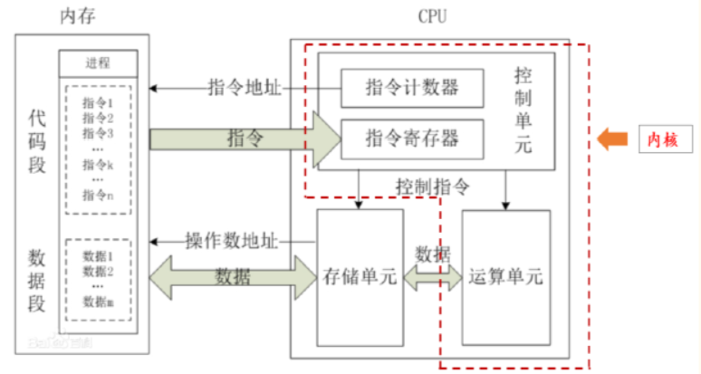

# CPU架构
## 什么是CPU架构
中央处理器（Central Processing Unit，CPU）主要由运算器、控制器、寄存器和连接总线组成。其中，控制器和运算器组成CPU的内核。内核从存储器中提取数据，根据控制器中的 **指令集** 将数据解码，通过运算器中的 **微架构（电路）** 进行运算得到结果，以某种格式将执行结果写入存储器。 因此，内核的基础就是**指令集**和**微架构**。

## 什么是指令集
指令集架构（ Instruction Set Architecture, ISA）是计算机体系结构中与程序设计有关的部分，包含了基本数据类型，指令集，寄存器，寻址模式，存储体系，中断，异常处理以及外部 I/O 。指令集架构包含一系列的 opcode 即操作码（机器语言），以及由特定处理器执行的基本命令。 简单来说，指令集一般被整合在操作系统内核最底层的硬件抽象层中，属于计算机中硬件与软件的接口，它向操作系统定义了CPU的基本功能。

## 什么是微架构
ISA在处理器中的实现，被称为Microarchitecture（微架构）。相同的指令集可以有不同的微架构，如 Intel 和 AMD 都是基于 X86 指令集但微架构不同。

## 程序语言与ISA的关系
计算机语言有三个代际：
1. 机器语言（二进制的机器代码/指令集集合）
2. 汇编语言/符号语言
3. 高级语言，如python、Java等。

越低级的语言越贴近计算机识别的二进制机器码，越高级的语言越贴近人类自然语言。因此在我们执行高级语言时，无论是解释型还是编译型，**最终都要按照某种指令集规范翻译成二进制代码**。

## ISA的分类
现代CPU架构主要分为以下两大类：
*  复杂指令集(Complex Instruction Set Architecture, CISC)
    * 复杂的指令集：CISC处理器的指令集非常丰富，可以在一条指令中完成多个操作。
    * 多种寻址模式：CISC架构支持多种复杂的寻址模式，使得编写高级语言的编译器更加方便。
    * 微代码实现：CISC处理器通常通过微代码实现复杂指令，这使得处理器可以支持更多的指令类型。
    * 指令长度不固定：CISC指令的长度不固定，这使得指令的解码和执行更加复杂，但也更灵活。

*  精简指令集(Reduced Instruction Set Architecture, RISC)
    * 简化的指令集：RISC处理器的指令集相对简单，每条指令执行时间固定，通常在一个时钟周期内完成。
    * 较少的寻址模式：RISC架构通常只支持几种简单的寻址模式，这使得指令解码和执行更加高效。
    * 大量寄存器：RISC处理器通常拥有较多的寄存器，以减少对内存的访问频率，从而提高性能。
    * 硬件实现的流水线：RISC架构通过硬件实现指令流水线，使得多个指令可以同时进行处理，从而提高指令的执行速度。

|对比项	|CISC |RISC|
|--|--|--|
|目的|增强原有指令的功能，设置更为复杂的新指令实现软件功能的硬化|减少指令种类和简化指令功能，提高指令的执行速度|
|指令系统|复杂、庞大|简单、精简|
|指令数目|一般大于200条|一般小于100条|
|指令字长|不固定|固定|
|可访存指令|不加限制|只有LOAD/STORE指令|
|各指令的执行时长|指令间执行时长差距很大|绝大多数在1个周期内完成|
|各种指令的使用频度|指令间频度差距很大|指令都比较常用|
|通用寄存器数量|较少|多|
|中断|机器是在一条指令执行结束后响应中断|机器在一条指令执行的适当地方可响应中断|
|单元电路（功耗）|包含有丰富的电路单元，因而功能强、面积大、功耗大|包含有较少的单元电路，因而面积小、功耗低|
|目标代码的执行效率|难以用优化编译生成高效的目标代码程序|采用优化的编译程序，生成代码相对较为高效|
|控制方式|绝大多数为微程序控制|绝大多数为组合逻辑控制|
|指令流水线|可以通过一定方式实现|必须实现|
|微处理器的设计周期|微处理器结构复杂，设计周期长|微处理器结构简单，布局紧凑，设计周期短，且易于采用最新技术|
|适用场景|适用于【通用型机器】；功能强大，易于/利于实现、处理特殊功能，因有专用指令来完成特定功能|适用于【专用型机器】，因RISC指令系统的确定与特定的应用领域有关；指令规整，性能容易把握，易学易用|
|被应用的指令集(架构)|X86指令集(架构)|MIPS、ARM、RISC-V、Power-PC[IBM]、SPARC、AArch64(基于ARMv8架构的、分离出来的64位的执行状态)指令集(架构)|

## 四种主流ISA
|序号|架构|特点|代表性的厂商|运营机构|发明时间|
|--|--|--|--|--|--|
|1|X86|性能高，速度快，兼容性好|英特尔，AMD|英特尔|1978年|
|2|ARM|成本低，低功耗|苹果，谷歌，IBM，华为|英国ARM公司|1983年|
|3|RISC-V|模块化，极简，可拓展|三星，英伟达，西部数据|RISC-V基金会|2014年|
|4|MIPS|简洁，优化方便，高拓展性|龙芯|MIPS科技公司|1981年|
