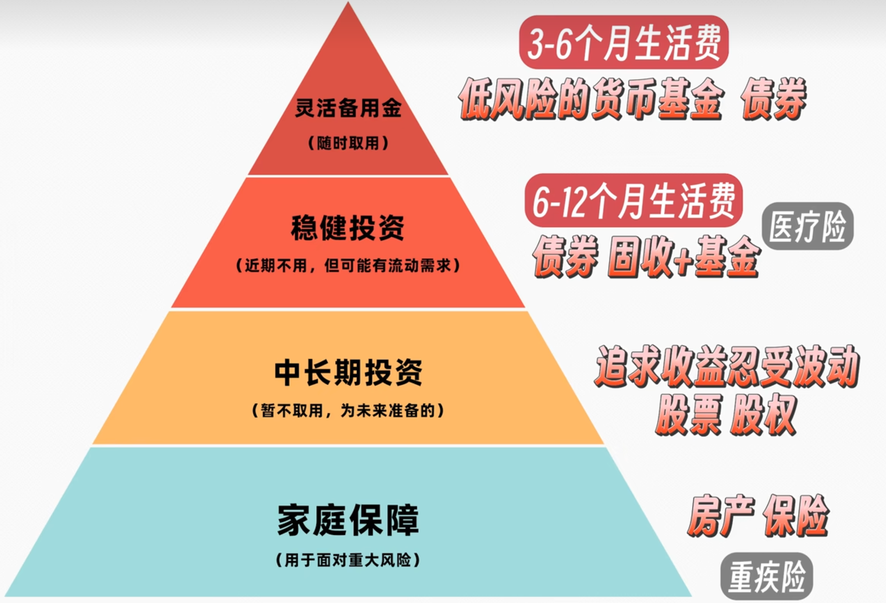

# 家庭资产配置
## 标准模型
**普尔模型**是经典的家庭资产配置模型，也称为“4321法则”。但是我认为普尔模型不能自洽。比如，家庭资产非常多或非常少时，10%不一定对应3-6个月的开支。
在[全嘻嘻的视频](https://www.bilibili.com/video/BV1Rj421R7uH/?share_source=copy_web&vd_source=9eb6d7fad45f9fa869cd9abb34fa68ca)中我看到更合理的一种表达方法：不按照4321的比例进行分配，而是按照先满足上层后，再进行下一个等级的分配。

按照每个月7000元的生活标准进行计算，那么配置的流程应当：
1. **灵活备用金**准备 `21k - 42k` ,一般放入余额宝等货币基金中，随用随取。
2. **稳健投资**准备 `42k - 84k` 用于医疗险、债券、固收+基金。这些资产近期不会用到，但可能会有流动性需求。
3. **中长期投资**按需分配，主要为未来 10 - 20 年的规划准备。比如小孩的教育等。由于投资期长，可以忍受收益波动来追求收益。适合购买股票、期权。
4. **家庭保障**是满足了上述所有后的投资，是用于抵抗重大风险的资产。如房产、保险、重疾险等。